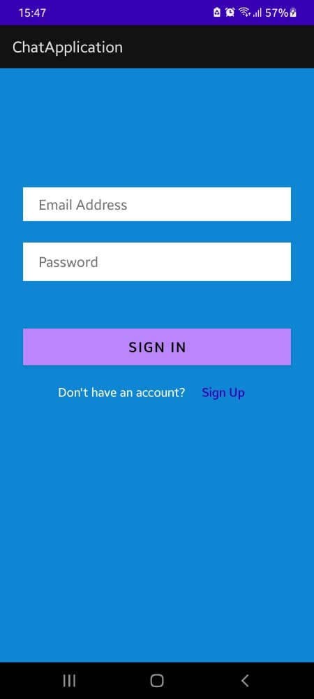
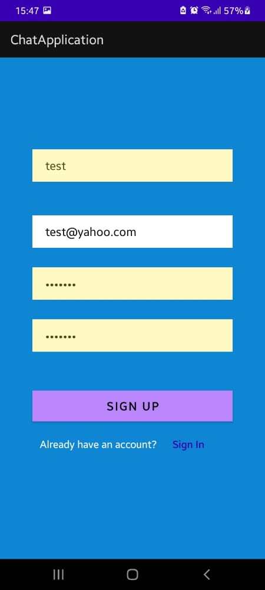
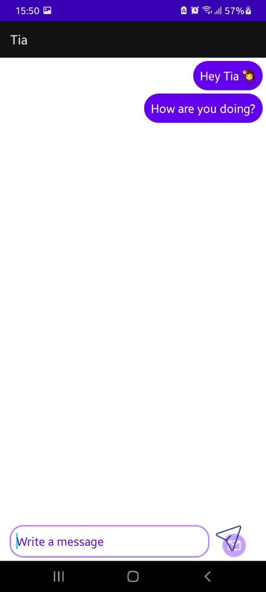
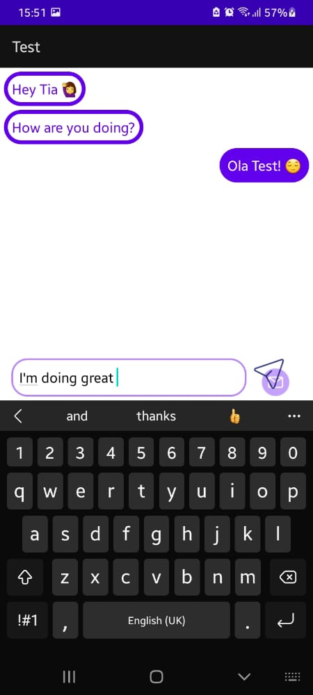

# csc327-chat-app
The project was implemented using the language kotlin and in android studio. The database used was Firebase.

# Demonstration

References
- [Authentication](https://medium.com/@mutebibrian256/firebase-authentication-with-email-and-password-in-android-using-kotlin-5fbe61ee6252)
- [Chat Features](https://www.youtube.com/watch?v=8Pv96bvBJL4)
